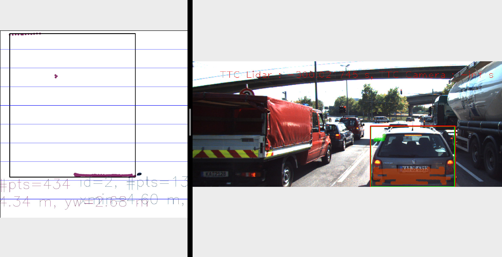

# SFND 3D Object Tracking

Welcome to the final project of the camera course. By completing all the lessons, you now have a solid understanding of keypoint detectors, descriptors, and methods to match them between successive images. Also, you know how to detect objects in an image using the YOLO deep-learning framework. And finally, you know how to associate regions in a camera image with Lidar points in 3D space. Let's take a look at our program schematic to see what we already have accomplished and what's still missing.


In this final project, you will implement the missing parts in the schematic. To do this, you will complete four major tasks: 
1. First, you will develop a way to match 3D objects over time by using keypoint correspondences. 
2. Second, you will compute the TTC based on Lidar measurements. 
3. You will then proceed to do the same using the camera, which requires to first associate keypoint matches to regions of interest and then to compute the TTC based on those matches. 
4. And lastly, you will conduct various tests with the framework. Your goal is to identify the most suitable detector/descriptor combination for TTC estimation and also to search for problems that can lead to faulty measurements by the camera or Lidar sensor. In the last course of this Nanodegree, you will learn about the Kalman filter, which is a great way to combine the two independent TTC measurements into an improved version which is much more reliable than a single sensor alone can be. But before we think about such things, let us focus on your final project in the camera course. 

## Dependencies for Running Locally
* cmake >= 2.8
  * All OSes: [click here for installation instructions](https://cmake.org/install/)
* make >= 4.1 (Linux, Mac), 3.81 (Windows)
  * Linux: make is installed by default on most Linux distros
  * Mac: [install Xcode command line tools to get make](https://developer.apple.com/xcode/features/)
  * Windows: [Click here for installation instructions](http://gnuwin32.sourceforge.net/packages/make.htm)
* Git LFS
  * Weight files are handled using [LFS](https://git-lfs.github.com/)
  * Install Git LFS before cloning this Repo.
* OpenCV >= 4.1
  * This must be compiled from source using the `-D OPENCV_ENABLE_NONFREE=ON` cmake flag for testing the SIFT and SURF detectors.
  * The OpenCV 4.1.0 source code can be found [here](https://github.com/opencv/opencv/tree/4.1.0)
* gcc/g++ >= 5.4
  * Linux: gcc / g++ is installed by default on most Linux distros
  * Mac: same deal as make - [install Xcode command line tools](https://developer.apple.com/xcode/features/)
  * Windows: recommend using [MinGW](http://www.mingw.org/)

## Basic Build Instructions

1. Clone this repo.
2. Make a build directory in the top level project directory: `mkdir build && cd build`
3. Compile: `cmake .. && make`
4. Run it: `./3D_object_tracking`.


## Steps

### FP.1 Match 3D Objects

Implement a method named "matchBoundingBoxes" that takes both previous and current data frames as input and outputs the matched region of interest IDs (the boxID property). Utilize `multimap<int,int> boxmap{}` to store pairs of bounding box IDs. The matches should be the ones with the highest count of keypoint correspondences.


```c++
void matchBoundingBoxes(std::vector<cv::DMatch> &matches, std::map<int, int> &bbBestMatches, DataFrame &prevFrame, DataFrame &currFrame)
{
    multimap<int,int> boxmap{};
    for(auto match:matches){
        cv::KeyPoint prevPoints=prevFrame.keypoints[match.queryIdx];
        cv::KeyPoint currPoints=currFrame.keypoints[match.trainIdx];
        int prevBoxId=-1;
        int currBoxId=-1;

        for(auto box:prevFrame.boundingBoxes){
            if (box.roi.contains(prevPoints.pt)) prevBoxId=box.boxID;
        }
        for(auto box:currFrame.boundingBoxes){
            if (box.roi.contains(currPoints.pt)) currBoxId = box.boxID;
        }
        // generate currBoxId-prevBoxId map pair
        boxmap.insert({currBoxId,prevBoxId});

    }

    int prevBoxSize = prevFrame.boundingBoxes.size();
    // find the best matched previous boundingbox for each current boudingbox
    for(int i=0;i<prevBoxSize;++i){
        auto boxmapPair=boxmap.equal_range(i);
        vector<int> currBoxCount(prevBoxSize,0);
        for(auto pr=boxmapPair.first;pr!=boxmapPair.second;++pr){
            if((*pr).second>=0) currBoxCount[(*pr).second]+=1;
        }
        // find the position of best prev box which has highest number of keypoint correspondences.
        int maxPosition = std::distance(currBoxCount.begin(), std::max_element(currBoxCount.begin(), currBoxCount.end()));
        bbBestMatches.insert({maxPosition,i});
    }

}
```

### FP.2 Compute lidar-based TTC

Compute the time-to-collision (TTC) in seconds for all matched 3D objects using only the Lidar measurements from the matched bounding boxes between the current and previous frames. The median of the x-distance is used to minimize the influence of outliers. A constant-velocity model is employed for TTC calculation. The 6-sigma principle is utilized to filter out outliers.


A plot of [normal distribution](https://en.wikipedia.org/wiki/Normal_distribution) (or bell-shaped curve) where each band has a width of 1 standard deviation.

```c++
void computeTTCLidar(std::vector<LidarPoint> &lidarPointsPrev,
                 std::vector<LidarPoint> &lidarPointsCurr, double frameRate, double &TTC)
{
    double dT=1/frameRate;
    double laneWidth=4.0;
    vector<double> lidarPointsCurrX,lidarPointsPrevX;
    for(auto it =lidarPointsPrev.begin();it!=lidarPointsPrev.end();++it){
        if(abs(it->y)<=laneWidth/2.0){
            lidarPointsPrevX.push_back(it->x);
        }
    }
    for (auto it = lidarPointsCurr.begin(); it != lidarPointsCurr.end(); ++it)
    {

        if (abs(it->y) <= laneWidth / 2.0){
            lidarPointsCurrX.push_back(it->x);
        }
    }
        double XCurrSum = accumulate(lidarPointsCurrX.begin(), lidarPointsCurrX.end(), 0.0);
        double XPrevSum = accumulate(lidarPointsPrevX.begin(), lidarPointsPrevX.end(), 0.0);
        double CurrMean = XCurrSum / lidarPointsCurrX.size();
        double PrevMean = XPrevSum / lidarPointsPrevX.size();
        double Curraccum = 0.0;
        double Prevaccum = 0.0;
        for_each(begin(lidarPointsCurrX), std::end(lidarPointsCurrX), [&](const double d) {
            Curraccum += (d - XCurrSum) * (d - XCurrSum);
        });

        double CurrStd = sqrt(Curraccum / (lidarPointsCurrX.size() - 1));

        for_each(begin(lidarPointsPrevX), std::end(lidarPointsPrevX), [&](const double d) {
            Prevaccum += (d - XPrevSum) * (d - XPrevSum);
        });

        double PrevStd = sqrt(Prevaccum / (lidarPointsPrevX.size() - 1));
        int CurrCount = 0;
        int PrevCount = 0;
        double CurrAns = 0;
        double PrevAns = 0;
        for (int i = 0; i < lidarPointsCurrX.size(); ++i) {
            if (abs(lidarPointsCurrX[i] - CurrMean) < 3 * CurrStd) {
                CurrAns += lidarPointsCurrX[i];
                ++CurrCount;
            }
        }

        for (int i = 0; i < lidarPointsPrevX.size(); ++i) {
            if (abs(lidarPointsPrevX[i] - PrevMean) < 3 * PrevStd) {
                PrevAns += lidarPointsPrevX[i];
                ++PrevCount;
            }
        }
        
        double d1 = CurrAns / CurrCount;
        double d0 = PrevAns / PrevCount;
        TTC = d1 * dT / (d0 - d1);
    }

}
```

### FP.3 Associate Keypoint Correspondences with Bounding Boxes

Prepare for TTC computation based on camera measurements by associating keypoint correspondences to the bounding boxes enclosing them. All matches fulfilling this condition should be added to a vector within the respective bounding box. The mean of Dmatch distance of all matches is used as a threshold to filter out matches with low similarity.

```c++
void clusterKptMatchesWithROI(BoundingBox &boundingBox, std::vector<cv::KeyPoint> &kptsPrev, std::vector<cv::KeyPoint> &kptsCurr, std::vector<cv::DMatch> &kptMatches)
{
    std::vector<cv::DMatch> kptMatchesRoi; 
    for (auto match : kptMatches) {
        if (boundingBox.roi.contains(kptsCurr[match.trainIdx].pt)) {
            kptMatchesRoi.push_back(match); 
        }
    }
    if (kptMatchesRoi.empty()) 
        return; 

    // filter matches 
    double accumulatedDist = 0.0; 
    for  (auto it = kptMatchesRoi.begin(); it != kptMatchesRoi.end(); ++it)  
         accumulatedDist += it->distance; 
    double meanDist = accumulatedDist / kptMatchesRoi.size();  
    double threshold = meanDist * 0.7;        
    for  (auto it = kptMatchesRoi.begin(); it != kptMatchesRoi.end(); ++it)
    {
       if (it->distance < threshold)
           boundingBox.kptMatches.push_back(*it);
    }
    cout << "Leave " << boundingBox.kptMatches.size()  << " matches" << endl;
}
```

### FP.4 Compute Camera-based TTC

Compute the TTC for all matched 3D objects using only keypoint correspondences from the matched bounding boxes between the current and previous frames. The median of distance ratios is used to minimize the influence of outliers, with a constant-velocity model employed for TTC calculation.


```c++
void computeTTCCamera(std::vector<cv::KeyPoint> &kptsPrev, std::vector<cv::KeyPoint> &kptsCurr, 
                      std::vector<cv::DMatch> kptMatches, double frameRate, double &TTC, cv::Mat *visImg)
{
    vector<double> distRatios; // stores the distance ratios for all keypoints between curr. and prev. frame
    for (auto it1 = kptMatches.begin(); it1 != kptMatches.end() - 1; ++it1)
    { // outer kpt. loop

        // get current keypoint and its matched partner in the prev. frame
        cv::KeyPoint kpOuterCurr = kptsCurr.at(it1->trainIdx);
        cv::KeyPoint kpOuterPrev = kptsPrev.at(it1->queryIdx);

        for (auto it2 = kptMatches.begin() + 1; it2 != kptMatches.end(); ++it2)
        { // inner kpt.-loop

            double minDist = 100.0; // min. required distance

            // get next keypoint and its matched partner in the prev. frame
            cv::KeyPoint kpInnerCurr = kptsCurr.at(it2->trainIdx);
            cv::KeyPoint kpInnerPrev = kptsPrev.at(it2->queryIdx);

            // compute distances and distance ratios
            double distCurr = cv::norm(kpOuterCurr.pt - kpInnerCurr.pt);
            double distPrev = cv::norm(kpOuterPrev.pt - kpInnerPrev.pt);

            if (distPrev > std::numeric_limits<double>::epsilon() && distCurr >= minDist)
            { // avoid division by zero

                double distRatio = distCurr / distPrev;
                distRatios.push_back(distRatio);
            }
        } 
    }     

    // only continue if list of distance ratios is not empty
    if (distRatios.size() == 0)
    {
        TTC = NAN;
        return;
    }
    std::sort(distRatios.begin(), distRatios.end());
    int distRatioSize= distRatios.size();
    double medianDistRatio = distRatioSize%2==0? (distRatios[distRatioSize/ 2-1]+distRatios[distRatioSize/2])/2:distRatios[distRatioSize/2];

    // Finally, calculate a TTC estimate based on these 2D camera features
    TTC = (-1.0 / frameRate) / (1 - medianDistRatio);

}
```

## FP.5 Performance Evaluation 1

Identify examples where the Lidar-based TTC estimation seems implausible. Describe observations and provide reasoning for any discrepancies noted. 


<p align = "center">
  
</p>

<p align = "center">
  
</p>

<p align = "center">
  
</p>

As can be seen from above images, TTC estimation is very unstable, although they are adjacent frames. In order to reject the outliers and make the estimation more robust, the median point in x_direction is choosen as the targeted lidar point for TTC calculation. 
```
TTC = medianXCurr * dT / (medianXPrev - medianXCurr);
```
There is a red light in front and the speed of cars are all slow or even close to zero. Therefore, the delta of medianXPrev and medianXCurr is extremely small. This will cause the TTC estimiation unstable. 


### FP.6 Performance Evaluation 2

Execute various detector/descriptor combinations and observe the differences in TTC estimations. Identify which methods perform optimally and provide examples where the camera-based TTC estimation is significantly off. Similar to Lidar, describe observations and delve into potential causes.


For 1st and 2nd frame: lidar TTC(s): 12.2891

| Camera TTC(s)           |             |         |             |         |         |         |
| ----------------------- | ----------- | :-----: | :---------: | :-----: | :-----: | :-----: |
| **Detector/Descriptor** | BRISK       |  BRIEF  |     ORB     |  FREAK  |  AKAZE  |  SIFT   |
| SHI-TOMASI              | 10.4544     | 11.5702 |   10.9314   | 11.8606 |    X    | 12.4518 |
| HARRIS                  | non         | 8.81335 |   10.9082   | 8.75397 |    X    | 8.81335 |
| FAST                    | **12.555**  | 10.6507 |   11.6137   | 11.7545 |    X    |  11.99  |
| BRISK                   | 12.8364     | 10.5599 | **12.3924** | 10.9016 |    X    | 15.5841 |
| ORB                     | 12.1791     | 16.4808 |   19.7314   | 12.2074 |    X    | 9.83629 |
| AKAZE                   | **12.2628** | 12.4103 |   11.4295   | 11.6351 | 11.8071 | 12.273  |
| SIFT                    | 11.8926     | 11.8654 |      X      | 10.5213 |    X    | 10.2713 |


The three most optimal detector/descriptor combinations are:

AKAZE/BRISK

FAST/BRISK

BRISK/ORB